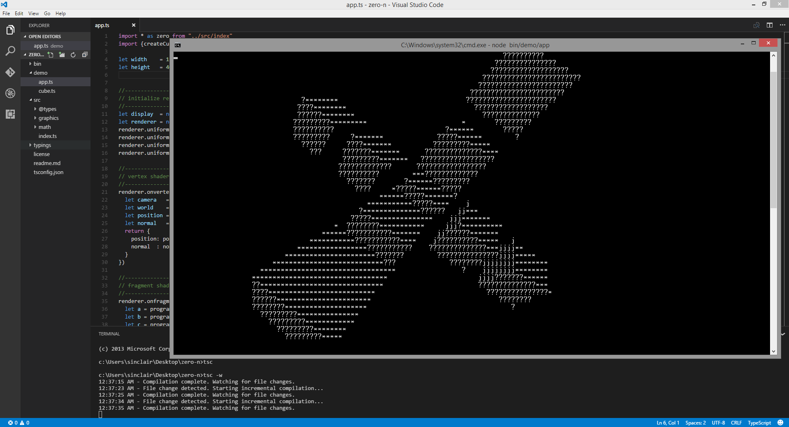

# zero-n

A 3D graphics rendering pipeline, implemented in JavaScript for terminal displays.



## overview

Ever wanted to render interactive 3D graphics in your terminal?

zero-n is a small software 3D renderer written in JavaScript that 
can turn your nodejs terminal into a interactive 3D scene. This software 
attempts to emulate parts of a modern graphics pipeline, going as far 
to implement programmable vertex and fragment stages.

zero-n was written as a small weekend project to see what was 
reasonably possible to implement with JavaScript alone without
adversely effecting performance. As it turns out, quite a lot.

This project is offered as is for anyone who finds it useful
or interesting.

zero includes.
- support vector and matrix math libraries.
- programmable vertex and fragment stages with overly optimized vector math support.
- terminal display device (for ascii terminal rendering as default)
- A fixed memory footprint, and no GC leaks.

## building and running the demo

zero-n is written using the TypeScript 2.0.2 compiler and Node 6.x you will need to install
these things to build.

(assumes node 6.x + npm is already installed)

```
npm install typescript@2.0.2
tsc -p tsconfig.json
node bin/demo/app
```


